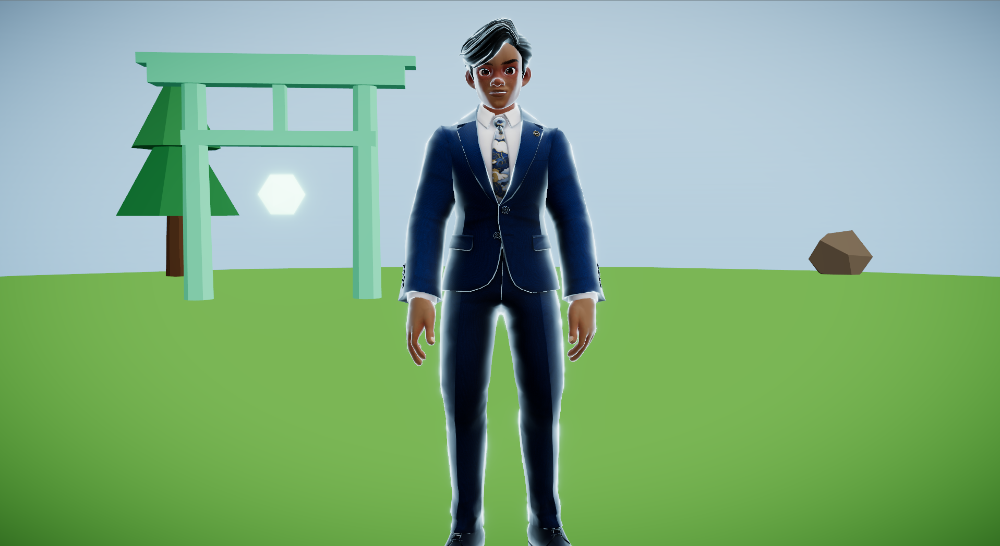

# 3D Anime Portfolio

A gamified, cel-shaded **3D developer portfolio** — a floating anime island you
walk around as a character, entering torii gates to open each section (About,
Projects, Experience, Résumé, Contact). Built from scratch with React Three
Fiber and Three.js.

<!-- Add a screenshot: save one to docs/preview.png, then this image appears here. -->
<p align="center">
  
</p>

## Overview

Instead of scrolling a page, you **explore a world**. A VRM avatar with keyboard
locomotion (walk / sprint) roams a code-built floating island under a third-person
follow camera. Each portfolio section is a glowing **torii gate**; walk up and a
proximity prompt invites you to open a panel with that section's content. The
look is anime / cel-shaded: toon-banded environment, a custom Fresnel rim light on
the character, and an HDR bloom + ACES tone-mapping post-processing pipeline.

## Features

- 🕹️ **Walkable character** — camera-relative WASD/arrow movement, hold **Shift**
  to sprint, with smooth idle ↔ walk ↔ run animation crossfades.
- 🎥 **Third-person follow camera** — orbit and zoom while the character stays
  centered.
- 🏝️ **Floating island world** — a fully code-built island (flat walkable top,
  rock spire, gradient sky, low-poly props), no imported level model.
- ⛩️ **Five interactive regions** — torii-gate markers with proximity prompts and
  section-appropriate panels (prose + skills, project cards, experience timeline,
  embedded résumé PDF, contact links) — all **data-driven** from one config file.
- ✨ **Anime rendering** — `MeshToonMaterial` cel shading, a custom view-space
  Fresnel rim shader, and selective **bloom + vignette + ACES** post-processing,
  all live-tunable via a Leva panel.
- 🎞️ **Mixamo → VRM animation retargeting** — Mixamo FBX clips retargeted onto the
  VRM humanoid (bone remap, rest-pose reconciliation, hips-height scaling, baked
  root-motion stripping).

## Controls

| Action           | Input                                            |
| ---------------- | ------------------------------------------------ |
| Move             | `W` `A` `S` `D` or arrow keys                     |
| Sprint           | Hold `Shift`                                      |
| Orbit camera     | Left-click + drag                                 |
| Zoom             | Scroll                                            |
| Open a section   | Walk up to a torii gate, then press `E` or click |
| Close a section  | `E` again, `Esc`, the ✕, or click the backdrop   |

## Tech stack

- **React 19** + **Vite 6**  (plain JavaScript)
- **three** r185 · **@react-three/fiber** v9 · **@react-three/drei**
- **@pixiv/three-vrm** v3 (VRM avatar + MToon-compatible pipeline)
- **@react-three/postprocessing** + **postprocessing** 6.37 (bloom / vignette / ACES)
- **leva** (live tuning panel)

> **Note:** Vite is pinned to **v6** on purpose — the project targets **Node 18**,
> and Vite 7 requires Node ≥ 20.19. Upgrade Node later to move to Vite 7.

## Getting started

Requires **Node 18+** and npm.

```bash
git clone https://github.com/kartsen03/3D-Anime-Portfolio.git
cd 3D-Anime-Portfolio
npm install
npm run dev
```

Then open **http://localhost:5173**. The 3D assets (avatar, animations, résumé)
are included in `public/`, so it runs with no extra setup.

```bash
npm run build     # production build to dist/
npm run preview   # preview the production build locally
```

## Project structure

The world is composed declaratively — the React tree *is* the Three.js scene
graph. For the full file map and how the pieces fit (rendering pipeline,
animation retargeting, the data-driven region system), see
**[ARCHITECTURE.md](ARCHITECTURE.md)**. Project conventions live in
**[CLAUDE.md](CLAUDE.md)**.

Adding or editing a section is a single edit to **`src/regionsConfig.js`** — the
markers, prompts, proximity, and panels all map over that array.

## Roadmap

- ✅ **M1–M8** — cel scene · VRM avatar · idle/walk/run locomotion · follow camera
  · bloom + Fresnel rim (Leva) · floating island + sky + props · five interactive
  regions with real content.
- 🔜 **M9 — art polish:** fog, drifting particles, floating debris, richer
  foliage, color grading, global edge-detection outline.
- 🔜 **M10 — performance + deploy:** effect gating for low-end devices, live hosting.

## Credits

- Character animations from **[Adobe Mixamo](https://www.mixamo.com/)**, retargeted
  onto the VRM humanoid.
- Built on the **React Three Fiber**, **drei**, and **@pixiv/three-vrm** ecosystems.

## License / usage

The **code** is shared for reference. The **content** (bio, project write-ups,
résumé, and likeness) is personal — please don't reuse it as your own. If you'd
like to build on the code, feel free to reach out.
